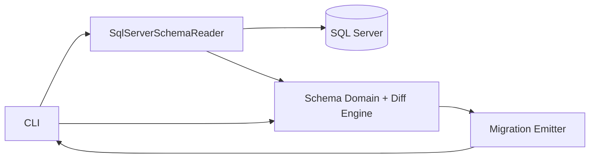
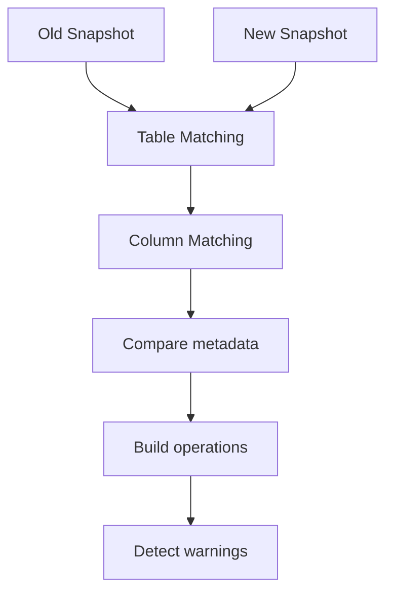

# Architecture

## Overview

Frapper está organizado como un conjunto de módulos enfocados en una responsabilidad específica: leer el esquema real de SQL Server, modelarlo en memoria, compararlo contra un snapshot anterior y emitir SQL de migración revisable.

La arquitectura busca ser:

- **modular**
- **determinística**
- **Dapper-friendly**
- **database-first**
- **fácil de testear**

---

## High-level components

| Component | Responsibility |
|---|---|
| `Frapper.Cli` | Punto de entrada, orquestación de comandos y flujos |
| `Frapper.Core` | Modelo de dominio del esquema y motor de diff |
| `Frapper.SqlServer` | Lectura de catálogo SQL Server y normalización |
| `Frapper.EFMigrationEmitter` | Emisión de migraciones SQL / artefactos de salida |
| `tests/*` | Validación de comportamiento crítico |

---

## Architectural principle

> The database schema is the source of truth.

Frapper no trata las clases C# ni un modelo ORM como representación oficial del esquema.  
El estado real del catálogo de SQL Server es el origen del snapshot y del diff.

---

## Main flow



---

## Internal flow

1. La CLI dispara una lectura del esquema.
2. `Frapper.SqlServer` consulta el catálogo.
3. El resultado se transforma a objetos del dominio en `Frapper.Core`.
4. El snapshot actual se compara con el snapshot anterior.
5. El diff genera operaciones estructurales.
6. El emisor traduce esas operaciones a SQL y warnings.

---

## Domain model

El corazón del sistema está en `Frapper.Core`.

### Main entities

- `DatabaseSchema`
- `DbTable`
- `DbColumn`
- `DbPrimaryKey`
- tipos auxiliares y metadata normalizada

### Why this matters

Este modelo desacopla la lectura del catálogo de la generación de migraciones.  
Así, el sistema puede evolucionar el reader, el diff engine y el emitter de manera independiente.

---

## Schema reading

`Frapper.SqlServer` se encarga de:

- consultar tablas
- consultar columnas
- consultar primary keys
- leer metadata relevante del catálogo
- normalizar tipos SQL a una representación estable

### Design goal

El reader no debería “inventar” semántica que no exista en la base.  
Su trabajo es producir una representación fiel y consistente del esquema.

---

## Snapshot strategy

Un snapshot útil en Frapper debe ser **determinístico**.

Eso implica:

- mismo orden para tablas y columnas
- tipos normalizados
- representación estable
- exclusión de ruido irrelevante

### Why determinism is critical

Sin determinismo:

- Git diffs se ensucian
- tests se vuelven frágiles
- cambios idénticos pueden parecer diferentes
- el motor de diff pierde confiabilidad

---

## Diff engine

El diff engine compara dos instancias de `DatabaseSchema`.

### Typical operations

- add table
- drop table
- add column
- drop column
- alter column
- primary key changes
- warnings por cambios sensibles

### Internal pipeline



### Current limitation

Hoy el diff es fuerte en cambios estructurales básicos, pero todavía no cubre de forma completa escenarios como:

- rename detection
- full foreign key modeling
- advanced constraints
- indexes
- programmable objects

---

## Migration emitter

`Frapper.EFMigrationEmitter` toma operaciones y produce SQL.

### Output goals

- SQL claro
- SQL auditable
- warnings visibles
- comportamiento testeable

### Example

```sql
ALTER TABLE [dbo].[Orders]
ADD [Status] NVARCHAR(20) NOT NULL DEFAULT 'Pending';
```

### Warning example

```sql
-- WARNING: DEFAULT constraint change detected
```

---

## Testing strategy

La arquitectura favorece tests unitarios por módulo.

### Examples

- tests de normalización de tipos
- tests de snapshot determinístico
- tests de diff engine
- tests del SQL emitter
- tests de warnings

### Why this matters

Un proyecto como Frapper corre el riesgo de romper compatibilidad lógica al crecer.  
Los tests actúan como red de seguridad para preservar determinismo y confianza en el diff.

---

## Design strengths

- Separación clara de responsabilidades
- Bajo acoplamiento entre lectura, diff y emisión
- Base sólida para evolución incremental
- Muy alineado con equipos Dapper
- Fácil de explicar en entrevistas técnicas

---

## Design weaknesses / trade-offs

- Muy centrado hoy en SQL Server
- Algunas heurísticas futuras serán difíciles sin introducir ambigüedad
- Rename detection real requiere inferencia cuidadosa
- Cuanto más soporte de catálogo se agregue, mayor será la complejidad del modelo

---

## Future architectural directions

Posibles evoluciones:

- capa explícita de snapshot serialization
- representación más rica de constraints
- estrategia extensible por motor de base de datos
- emitter desacoplado por target format
- CLI con command handlers dedicados
- safety layer para cambios destructivos

---

## Suggested long-term shape

```text
Frapper.Cli
Frapper.Application       (optional future)
Frapper.Core
Frapper.SqlServer
Frapper.Emitters.Sql
Frapper.Emitters.EFStyle  (optional future)
Frapper.Serialization     (optional future)
```

Esta separación no es obligatoria hoy, pero sirve como dirección si el proyecto crece.

---

## Summary

Frapper ya tiene una arquitectura convincente para un problema real:  
**dar versionado de esquema a equipos Dapper sin convertir EF Core en dependencia obligatoria**.

Su valor técnico está en la combinación de:

- introspección real del esquema
- snapshots determinísticos
- diff estructural
- SQL explícito y revisable
