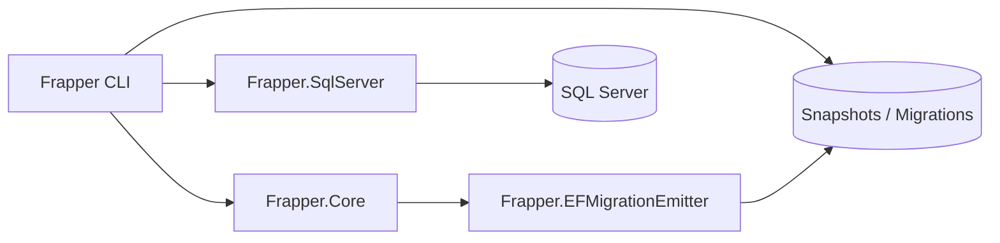
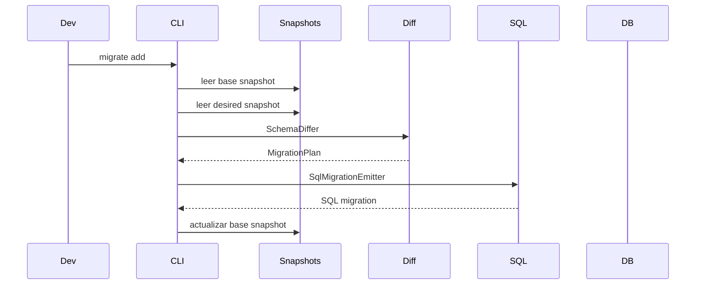
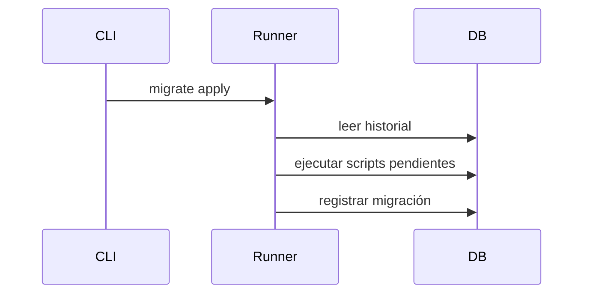
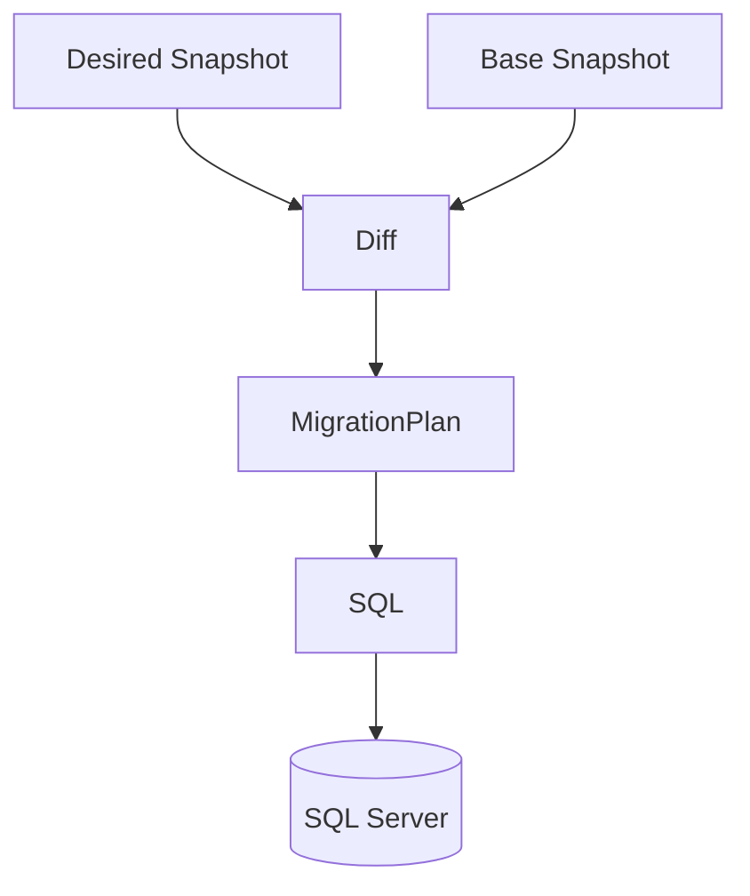

# Frapper Architecture

Este documento describe la arquitectura interna completa de **Frapper**, sus componentes, responsabilidades y cómo interactúan entre sí.

Frapper está diseñado como un sistema modular para permitir:

- introspección de esquemas de base de datos
- snapshots determinísticos
- comparación estructural de esquemas
- generación de migraciones SQL
- aplicación controlada de migraciones

---

# Principios de diseño

Frapper se basa en varios principios fundamentales.

## 1. Database‑first

El esquema real de la base de datos es una fuente importante de verdad.

Frapper puede:

- introspectar el esquema real
- generar snapshots
- detectar drift entre snapshots y base de datos

## 2. Snapshot‑driven

La evolución del esquema se basa en snapshots versionados.

Esto permite:

- reproducibilidad
- control en Git
- revisión de cambios
- auditoría de evolución del esquema

## 3. SQL explícito

Frapper evita generar abstracciones opacas.

Las migraciones son:

- SQL claro
- revisable
- ejecutable manualmente si se desea

## 4. Arquitectura modular

Cada componente del sistema tiene una responsabilidad clara.

Esto facilita:

- testing
- extensión
- soporte futuro para otros motores de base de datos

---

# Arquitectura de alto nivel



---

# Módulos del sistema

## Frapper.Cli

Responsable de:

- interfaz de línea de comandos
- orquestación de flujos
- lectura de configuración
- invocación de servicios del dominio

Comandos principales:

```
init
snapshot
diff
migrate add
migrate apply
```

Handlers principales:

```
InitHandler
SnapshotHandler
DiffHandler
MigrateAddHandler
MigrateApplyHandler
```

---

## Frapper.Core

Contiene el **dominio del sistema**.

Responsable de:

- modelar esquemas de base de datos
- representar operaciones de migración
- generar planes de migración

Clases principales:

```
DatabaseSchema
DbTable
DbColumn
DbPrimaryKey
SqlType
```

Interfaces importantes:

```
IDatabaseSchemaReader
ISchemaSnapshotSerializer
ISchemaDiffer
```

---

## Diff Engine

El motor de diff es uno de los componentes centrales del sistema.

Clase principal:

```
SchemaDiffer
```

Responsabilidades:

- comparar dos esquemas
- detectar cambios estructurales
- construir un `MigrationPlan`

---

## MigrationPlan

Representa el conjunto de operaciones necesarias para transformar un esquema en otro.

Incluye:

```
Up operations
Down operations
```

Operaciones soportadas actualmente:

```
CreateTableOp
DropTableOp
AddColumnOp
DropColumnOp
AlterColumnOp
```

---

## Frapper.SqlServer

Este módulo implementa el soporte para SQL Server.

Responsabilidades:

- introspección del catálogo
- lectura de metadata
- normalización de tipos
- ejecución de migraciones

Clases principales:

```
SqlServerSchemaReader
SqlServerTypeNormalizer
SqlServerMigrationRunner
```

---

## Frapper.EFMigrationEmitter

Responsable de traducir un `MigrationPlan` a SQL.

Clase principal:

```
SqlMigrationEmitter
```

Convierte operaciones del dominio en SQL.

Ejemplo:

```
AddColumnOp → ALTER TABLE ADD COLUMN
```

También agrega warnings cuando detecta cambios potencialmente peligrosos.

---

# Flujo interno de generación de migraciones



---

# Flujo de aplicación de migraciones



---

# Modelo de snapshots

Frapper trabaja con dos snapshots principales.

```
schema.snapshot.base.json
schema.snapshot.json
```

## Base snapshot

Representa el estado aprobado del esquema.

Se actualiza cuando se genera una migración:

```
migrate add
```

## Desired snapshot

Representa el estado deseado del esquema.

Puede modificarse:

- manualmente
- mediante generación desde la base de datos

## Base de datos real

La DB real puede compararse contra el snapshot base para detectar drift.



---

# Snapshot serialization

Los snapshots se serializan como JSON determinístico.

Responsable:

```
SchemaSnapshotSerializer
```

Objetivos:

- reproducibilidad
- diffs limpios en Git
- facilidad de inspección manual

---

# Manejo de migraciones

Las migraciones se almacenan como archivos SQL:

```
migrations/
```

Ejemplo:

```
20260309143000_AddCreatedAtToOrders.sql
```

---

# Tabla de historial

Las migraciones aplicadas se registran en:

```
dbo.__FrapperMigrationsHistory
```

Contiene:

- nombre de migración
- timestamp de ejecución

---

# Testing

Frapper incluye tests para:

- diff engine
- snapshot serialization
- migration emission
- CLI handlers

Esto ayuda a asegurar estabilidad mientras el proyecto evoluciona.

---

# Extensibilidad futura

La arquitectura fue diseñada para permitir extensiones importantes.

## Nuevos motores de base de datos

Ejemplo futuro:

```
Frapper.PostgreSql
Frapper.MySql
```

Implementando:

```
IDatabaseSchemaReader
```

---

## Nuevos tipos de objetos de base de datos

Soporte futuro para:

- indexes
- foreign keys
- views
- stored procedures
- triggers

---

# Resumen

La arquitectura de Frapper separa claramente las responsabilidades:

```
Introspection
Snapshot
Diff
Migration Plan
SQL Emission
Migration Execution
CLI orchestration
```

Esto permite que cada componente evolucione de forma independiente y mantiene el sistema simple, predecible y extensible.
