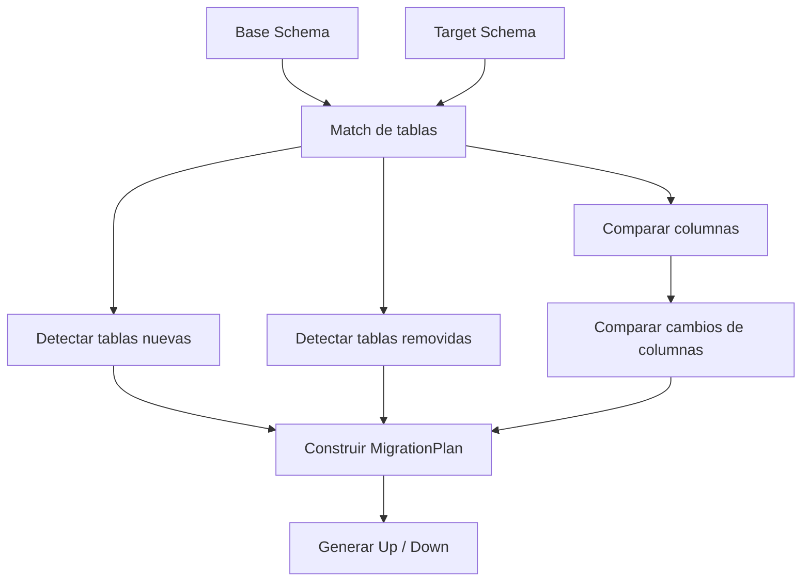

# Diff Engine

Este documento explica el corazón de Frapper: el motor que compara dos esquemas y construye un plan de migración.

---

## Objetivo

El `SchemaDiffer` compara:

- un esquema base
- un esquema objetivo

y genera un `MigrationPlan` con operaciones `Up` y `Down`.

---

## Entrada

El motor trabaja sobre objetos de dominio, no sobre JSON crudo.

Ejemplo conceptual:

```text
DatabaseSchema
 └─ DbTable
     ├─ DbColumn
     └─ DbPrimaryKey
```

---

## Salida

El resultado es un `MigrationPlan`:

```text
MigrationPlan
 ├─ Up   -> operaciones para avanzar
 └─ Down -> operaciones para revertir
```

Operaciones típicas:

- `CreateTableOp`
- `DropTableOp`
- `AddColumnOp`
- `DropColumnOp`
- `AlterColumnOp`

---

## Flujo interno



---

## Algoritmo conceptual

### 1. Match de tablas

Se construyen diccionarios por clave:

```text
schema.tableName
```

Con eso se detecta:

- tablas nuevas
- tablas removidas
- tablas presentes en ambos lados

### 2. Diff de columnas

Para tablas compartidas:

- se indexan columnas por nombre
- se detectan columnas nuevas
- se detectan columnas removidas
- se detectan columnas modificadas

### 3. Construcción del plan

Se generan operaciones `Up` y su correspondiente reversa en `Down`.

---

## Comparación de columnas

Actualmente la igualdad de columnas se basa en propiedades como:

- tipo SQL
- nullability
- identity
- default SQL

Eso permite detectar `AlterColumnOp` cuando cambia algo relevante.

---

## Opciones de diff

El motor recibe `DiffOptions`.

Ejemplos:

- `AllowDestructiveChanges`
- `StrictTypeMatching`

Esto permite controlar el comportamiento del plan.

---

## Limitaciones actuales

Todavía no cubre completamente:

- rename detection
- foreign keys
- índices
- unique constraints
- objetos programables

---

## Evolución futura

Las mejoras más naturales del diff engine son:

- rename detection conservador
- soporte de índices
- soporte de FK
- comparaciones semánticas más ricas
- mejor clasificación de cambios destructivos
