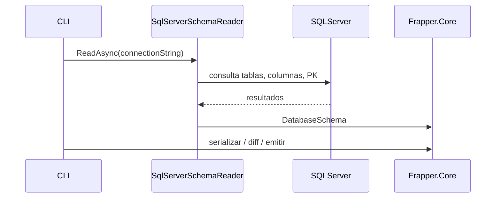
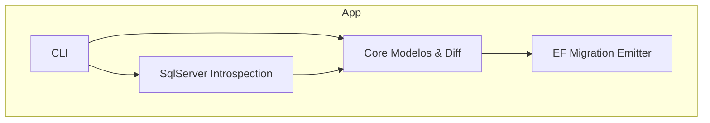

# Frapper
Schema migrations for Dapper-first .NET architectures.


Un conjunto de utilidades para inspeccionar esquemas de bases de datos SQL Server, generar snapshots de esquema y emitir artefactos de migración (emisor para EF Core). Proyecto modular compuesto por librerías y una herramienta de línea de comandos.

## Tags


# Frapper

**Migraciones de base de datos para arquitecturas .NET que utilizan Dapper.**

Frapper es una herramienta diseñada para equipos que utilizan **Dapper como ORM principal** y necesitan un mecanismo confiable para **versionar y evolucionar el esquema de la base de datos**, similar a lo que ofrecen las migraciones de Entity Framework.

La idea central es simple: permitir que los equipos mantengan **control total sobre el SQL que ejecutan**, sin renunciar a las ventajas de un sistema de migraciones estructurado.

---

# El Problema

En muchos sistemas .NET de alto rendimiento, los equipos prefieren **Dapper** en lugar de Entity Framework debido a varias razones:

- Permite **control total sobre el SQL** ejecutado.
- Evita el SQL complejo o subóptimo que a veces generan los ORMs.
- Facilita la optimización manual de consultas críticas.
- Reduce la complejidad de la capa de acceso a datos.
- Es más predecible en entornos de producción con cargas elevadas.

Sin embargo, esta decisión introduce una desventaja clara:

**Dapper no provee un sistema de migraciones para versionar el esquema de la base de datos.**

Esto suele llevar a soluciones menos ideales como:

- Scripts SQL manuales
- Procesos de despliegue frágiles
- Herramientas externas desconectadas del flujo de desarrollo
- Inconsistencias entre entornos

---

# La Solución

Frapper resuelve este problema introduciendo **migraciones basadas en el esquema real de la base de datos**, sin depender de modelos ORM.

A diferencia de Entity Framework, donde las migraciones se generan a partir de clases C#, Frapper trabaja directamente sobre el **estado actual del esquema en SQL Server**.

El flujo es el siguiente:

1. Frapper lee el esquema actual de la base de datos.
2. Se genera un **snapshot determinístico** del esquema.
3. Cuando el esquema cambia, Frapper calcula un **diff estructural**.
4. El diff se convierte en una **migración compatible con pipelines estilo EF**.

De esta manera, el esquema real de la base de datos se convierte en la **fuente de verdad**.

---

# Filosofía del Proyecto

Frapper está diseñado para complementar arquitecturas **Dapper-first**.

La responsabilidad de cada componente queda clara:

| Componente | Responsabilidad |
|------------|----------------|
| Dapper | Acceso a datos en tiempo de ejecución |
| SQL Server | Fuente de verdad del esquema |
| Frapper | Versionado del esquema y generación de migraciones |

Esto permite que cada herramienta haga exactamente lo que mejor sabe hacer.

---

# Flujo de Trabajo

Un flujo típico utilizando Frapper podría verse así:

### 1. Cambiar el esquema de la base de datos

Por ejemplo:

```sql
ALTER TABLE Orders
ADD Status NVARCHAR(20) NOT NULL DEFAULT 'Pending';

## Estado
- Compilado contra `net9.0`.
- Ejecutables y DLLs en `src/*/bin/Debug/net9.0/` (ver carpetas del proyecto).

## Estructura del proyecto
- `src/Frapper.Cli` – Interfaz de línea de comandos para usar las funcionalidades.
- `src/Frapper.Core` – Modelos del dominio (DatabaseSchema, DbTable, DbColumn, DbPrimaryKey, SqlType) y lógica de comparación/diff.
- `src/Frapper.SqlServer` – Introspección del catálogo de SQL Server y normalización de tipos.
- `src/Frapper.EFMigrationEmitter` – Emisor de operaciones para generar migraciones de EF Core (esqueleto).

## Dependencias
- SDK: .NET 9 SDK
- Cliente: Microsoft.Data.SqlClient (ya referenciado en el proyecto)

## Compilar y ejecutar (PowerShell)

1. Restaurar y compilar:

```powershell
dotnet restore
dotnet build -c Debug
```

2. Ejecutar la CLI desde el proyecto (versión actual de `Program.cs` imprime un mensaje simple):

```powershell
dotnet run --project src\Frapper.Cli
```

Ejemplo de output actual (según `src/Frapper.Cli/Program.cs`): (luego actualizamos esto, aun es una CLI mínima)

```
Hello, World!
```

3. Ejecutar el binario compilado directamente:

```powershell
& .\src\Frapper.Cli\bin\Debug\net9.0\Frapper.Cli.exe
```

Nota: la CLI aún es mínima en esta versión. Para ver comandos adicionales o argumentos cuando se implementen, revisar `src/Frapper.Cli/Program.cs` y el historial de commits.

## Uso interno (flujo resumido)

1. La CLI solicita la lectura del esquema.
2. `SqlServerSchemaReader` se conecta a SQL Server y lee: tablas, columnas, claves primarias.
3. Los tipos se normalizan con `SqlServerTypeNormalizer` y se construyen objetos `DbTable`, `DbColumn`, `DbPrimaryKey`.
4. El snapshot de esquema puede serializarse o compararse con otro para generar migraciones.

### Diagrama de secuencia (Mermaid)



### Diagrama de arquitectura (Mermaid)



## Contribuir
- Abrir un issue describiendo la mejora o bug.
- Fork + PR con una descripción clara.

## Licencia
Colocar aquí la licencia del proyecto (si procede).

---
Archivo generado automáticamente: proporciona una visión general, diagramas y pasos básicos para empezar. Para detalles de uso de la CLI revisar `src/Frapper.Cli/Program.cs` y la ayuda (`--help`).
