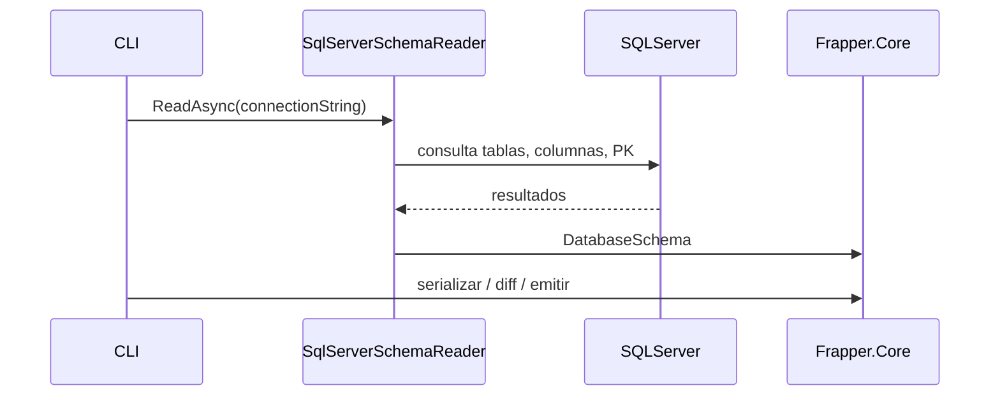

# Frapper

<span style="display:inline-block;background:#2d7fbf;color:#fff;padding:3px 8px;border-radius:4px;margin-right:6px">.NET</span>
<span style="display:inline-block;background:#6cc24a;color:#fff;padding:3px 8px;border-radius:4px;margin-right:6px">C#</span>
<span style="display:inline-block;background:#f0ad4e;color:#fff;padding:3px 8px;border-radius:4px;margin-right:6px">SqlServer</span>
<span style="display:inline-block;background:#8a6dce;color:#fff;padding:3px 8px;border-radius:4px">CLI</span>

Un conjunto de utilidades para inspeccionar esquemas de bases de datos SQL Server, generar snapshots de esquema y emitir artefactos de migración (emisor para EF Core). Proyecto modular compuesto por librerías y una herramienta de línea de comandos.

## Tags
- .NET 9
- C#
- SqlServer
- CLI
- Schema Introspection
- EF Core Migrations

## Estado
- Compilado contra `net9.0`.
- Ejecutables y DLLs en `src/*/bin/Debug/net9.0/` (ver carpetas del proyecto).

## Estructura del proyecto
- `src/Frapper.Cli` – Interfaz de línea de comandos para usar las funcionalidades.
- `src/Frapper.Core` – Modelos del dominio (DatabaseSchema, DbTable, DbColumn, DbPrimaryKey, SqlType) y lógica de comparación/diff.
- `src/Frapper.SqlServer` – Introspección del catálogo de SQL Server y normalización de tipos.
- `src/Frapper.EFMigrationEmitter` – Emisor de operaciones para generar migraciones de EF Core (esqueleto).

## Dependencias
- SDK: .NET 9 SDK
- Cliente: Microsoft.Data.SqlClient (ya referenciado en el proyecto)

## Compilar y ejecutar (PowerShell)

1. Restaurar y compilar:

```powershell
dotnet restore
dotnet build -c Debug
```

2. Ejecutar la CLI desde el proyecto (versión actual de `Program.cs` imprime un mensaje simple):

```powershell
dotnet run --project src\Frapper.Cli
```

Ejemplo de output actual (según `src/Frapper.Cli/Program.cs`): (luego actualizamos esto, aun es una CLI mínima)

```
Hello, World!
```

3. Ejecutar el binario compilado directamente:

```powershell
& .\src\Frapper.Cli\bin\Debug\net9.0\Frapper.Cli.exe
```

Nota: la CLI aún es mínima en esta versión. Para ver comandos adicionales o argumentos cuando se implementen, revisar `src/Frapper.Cli/Program.cs` y el historial de commits.

## Uso interno (flujo resumido)

1. La CLI solicita la lectura del esquema.
2. `SqlServerSchemaReader` se conecta a SQL Server y lee: tablas, columnas, claves primarias.
3. Los tipos se normalizan con `SqlServerTypeNormalizer` y se construyen objetos `DbTable`, `DbColumn`, `DbPrimaryKey`.
4. El snapshot de esquema puede serializarse o compararse con otro para generar migraciones.

### Diagrama de secuencia (Mermaid)



### Diagrama de arquitectura (Mermaid)

```mermaid
flowchart TB
    subgraph App
        CLI[CLI]
        Core[Core (Modelos & Diff)]
        Emitter[EF Migration Emitter]
        SqlMod[SqlServer Introspection]
    end

    CLI --> Core
    CLI --> SqlMod
    Core --> Emitter
    SqlMod --> Core
```

## Contribuir
- Abrir un issue describiendo la mejora o bug.
- Fork + PR con una descripción clara.

## Licencia
Colocar aquí la licencia del proyecto (si procede).

---
Archivo generado automáticamente: proporciona una visión general, diagramas y pasos básicos para empezar. Para detalles de uso de la CLI revisar `src/Frapper.Cli/Program.cs` y la ayuda (`--help`).
