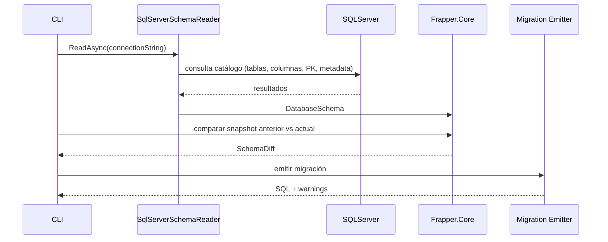
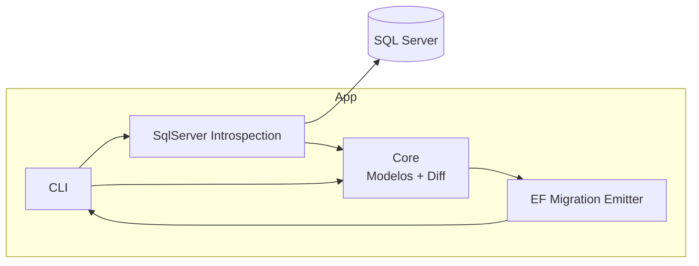
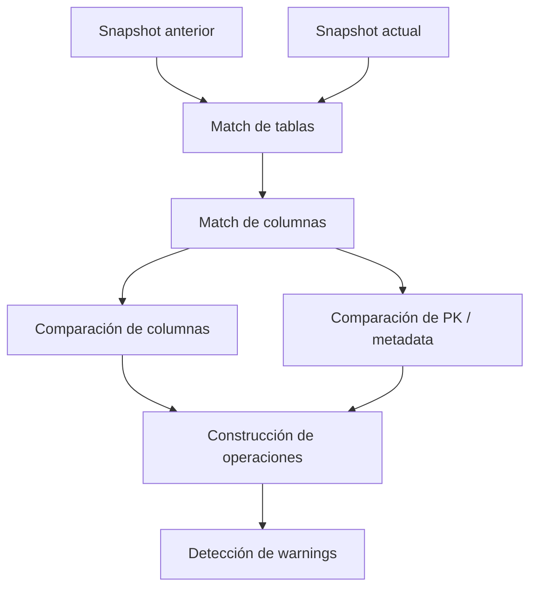

# Frapper


Un conjunto de utilidades para inspeccionar esquemas de bases de datos SQL Server, generar snapshots de esquema y emitir artefactos de migración para arquitecturas .NET que trabajan con **Dapper** y **SQL explícito**.  
Proyecto modular compuesto por librerías y una herramienta de línea de comandos.

---

## ¿Qué es Frapper?

**Migraciones de base de datos para arquitecturas .NET que utilizan Dapper.**

Frapper es una herramienta diseñada para equipos que utilizan **Dapper como ORM principal** y necesitan un mecanismo confiable para **versionar y evolucionar el esquema de la base de datos**, similar a lo que ofrecen las migraciones de Entity Framework, pero sin obligar al equipo a adoptar un ORM full-featured ni a tratar las clases C# como fuente de verdad del esquema.

La idea central es simple: permitir que los equipos mantengan **control total sobre el SQL que ejecutan**, sin renunciar a las ventajas de un sistema de migraciones estructurado.

En Frapper, la **fuente de verdad** es el **esquema real de SQL Server**.

---

## El Problema

En muchos sistemas .NET de alto rendimiento, los equipos prefieren **Dapper** en lugar de Entity Framework debido a varias razones:

- Permite **control total sobre el SQL** ejecutado.
- Evita el SQL complejo o subóptimo que a veces generan los ORMs.
- Facilita la optimización manual de consultas críticas.
- Reduce la complejidad de la capa de acceso a datos.
- Es más predecible en entornos de producción con cargas elevadas.

Sin embargo, esta decisión introduce una desventaja clara:

**Dapper no provee un sistema de migraciones para versionar el esquema de la base de datos.**

Esto suele llevar a soluciones menos ideales como:

- Scripts SQL manuales
- Procesos de despliegue frágiles
- Herramientas externas desconectadas del flujo de desarrollo
- Inconsistencias entre entornos
- Riesgo de drift entre ambientes
- Falta de trazabilidad clara sobre cómo evolucionó el esquema

---

## La Solución

Frapper resuelve este problema introduciendo **migraciones basadas en el esquema real de la base de datos**, sin depender de modelos ORM.

A diferencia de Entity Framework, donde las migraciones se generan a partir de clases C#, Frapper trabaja directamente sobre el **estado actual del esquema en SQL Server**.

El flujo general es el siguiente:

1. Frapper lee el esquema actual de la base de datos.
2. Genera un **snapshot determinístico** del esquema.
3. Cuando el esquema cambia, Frapper calcula un **diff estructural** entre snapshots.
4. El diff se convierte en una **migración SQL revisable**.
5. El equipo conserva control total sobre el SQL emitido y puede inspeccionarlo antes de ejecutarlo.

De esta manera, el esquema real de la base de datos se convierte en la **fuente de verdad**.

---

## EF Core vs Frapper

| Aspecto | EF Core Migrations | Frapper |
|---|---|---|
| Fuente de verdad | Modelos C# | Esquema real de SQL Server |
| Filosofía | ORM-first | Database-first / Dapper-friendly |
| Generación de cambios | Desde clases y metadatos EF | Desde diff de snapshots de esquema |
| Control del SQL | Parcial / mediado por EF | Alto, explícito y revisable |
| Ajuste para equipos Dapper | Bajo | Alto |

---

## Filosofía del Proyecto

Frapper está diseñado para complementar arquitecturas **Dapper-first**.

La responsabilidad de cada componente queda clara:

| Componente | Responsabilidad |
|------------|----------------|
| Dapper | Acceso a datos en tiempo de ejecución |
| SQL Server | Fuente de verdad del esquema |
| Frapper | Versionado del esquema, snapshots, diff y generación de migraciones |

Esto permite que cada herramienta haga exactamente lo que mejor sabe hacer.

---

## Flujo de Trabajo

Un flujo típico utilizando Frapper podría verse así:

### 1. Cambiar el esquema de la base de datos

Por ejemplo:

```sql
ALTER TABLE Orders
ADD Status NVARCHAR(20) NOT NULL DEFAULT 'Pending';
```

### 2. Generar una migración

```bash
frapper migrate add AddOrderStatus
```

### 3. Frapper detecta el cambio

Frapper:

- Lee el snapshot anterior
- Inspecciona el esquema actual
- Calcula el diff
- Genera la migración correspondiente

Ejemplo conceptual de migración emitida:

```csharp
protected override void Up(MigrationBuilder migrationBuilder)
{
    migrationBuilder.Sql("ALTER TABLE Orders ADD Status NVARCHAR(20) NOT NULL DEFAULT 'Pending';");
}
```

> Nota: el formato final de salida puede evolucionar. Lo importante hoy es la capacidad de detectar cambios estructurales y emitir SQL de migración revisable.

---

## Qué hace hoy Frapper

Actualmente el proyecto ya cubre una base sólida para el problema principal:

- **Inspección del catálogo de SQL Server**
- **Modelado del esquema** en objetos del dominio
- **Normalización de tipos SQL**
- **Generación de snapshots determinísticos**
- **Comparación estructural entre snapshots**
- **Emisión de SQL de migración**
- **Warnings para cambios potencialmente sensibles**, por ejemplo cambios en constraints por default
- **Suite de tests** para proteger comportamiento crítico

---

## Qué todavía le falta

Frapper todavía no pretende ser un reemplazo completo de todas las capacidades de un framework maduro de migraciones. Algunas áreas pendientes o parciales son:

- Soporte más completo para **foreign keys**
- Soporte para **índices**
- Soporte para **unique constraints**
- Detección semántica de **renames** (evitar drop + create cuando en realidad hubo rename)
- Soporte para **views**, **triggers** y **stored procedures**
- Estrategias robustas de **rollback / down migration**
- CLI más completa y amigable para escenarios reales
- Validaciones adicionales para cambios destructivos en producción

---

## Fortalezas

Frapper tiene varias fortalezas importantes, especialmente para un enfoque Dapper-first:

- **Database-first real**: el esquema de la base es la referencia principal.
- **Dapper-friendly**: no obliga al equipo a incorporar EF Core.
- **SQL explícito y auditable**: el resultado puede revisarse antes de ejecutarse.
- **Snapshots determinísticos**: ideal para Git, revisión de cambios y reproducibilidad.
- **Arquitectura modular**: separación clara entre lectura, modelo, diff y emisión.
- **Tests útiles**: ayudan a mantener estabilidad mientras el proyecto crece.

---

## Deficiencias / limitaciones actuales

También es importante ser transparente respecto a sus limitaciones actuales:

- Aún está orientado principalmente a **SQL Server**.
- La CLI todavía no expresa todo el potencial del motor interno.
- Algunos cambios complejos todavía pueden requerir revisión y ajuste manual.
- El motor aún no modela todas las estructuras del catálogo con el mismo nivel de profundidad.
- Algunos cambios pueden representarse de forma segura pero todavía no de forma “inteligente” (por ejemplo, renames).

---

## Estado

- Compilado contra `net9.0`.
- Ejecutables y DLLs en `src/*/bin/Debug/net9.0/` (según configuración de build).
- Los tests principales ya validan escenarios relevantes de diff y emisión.

---

## Estructura del proyecto

- `src/Frapper.Cli` – Interfaz de línea de comandos para usar las funcionalidades.
- `src/Frapper.Core` – Modelos del dominio (`DatabaseSchema`, `DbTable`, `DbColumn`, `DbPrimaryKey`, etc.) y lógica de comparación/diff.
- `src/Frapper.SqlServer` – Introspección del catálogo de SQL Server y normalización de tipos.
- `src/Frapper.EFMigrationEmitter` – Emisor de operaciones/migraciones SQL con enfoque compatible con flujos estilo EF.
- `tests/Frapper.Core.Tests` – Tests del dominio y diff.
- `tests/Frapper.SqlServer.Tests` – Tests de lectura y normalización.
- `tests/Frapper.EFMigrationEmitter.Tests` – Tests del emisor y warnings.

---

## Dependencias

- SDK: **.NET 9 SDK**
- Base de datos: **SQL Server**
- Cliente de conexión: **Microsoft.Data.SqlClient**

---

## Compilar y ejecutar

### Restaurar y compilar

```powershell
dotnet restore
dotnet build -c Debug
```

### Ejecutar la CLI desde el proyecto

```powershell
dotnet run --project src\Frapper.Cli
```

### Ejecutar el binario compilado directamente

```powershell
& .\src\Frapper.Cliin\Debug
et9.0\Frapper.Cli.exe
```

> Nota: la CLI aún es mínima en esta etapa del proyecto. El valor principal hoy está en las librerías y en el pipeline interno de snapshot → diff → emisión.

---

## Uso interno (flujo resumido)

1. La CLI solicita la lectura del esquema.
2. `SqlServerSchemaReader` se conecta a SQL Server y lee metadata relevante del catálogo.
3. Los tipos se normalizan con `SqlServerTypeNormalizer`.
4. Se construyen objetos del dominio como `DatabaseSchema`, `DbTable`, `DbColumn` y `DbPrimaryKey`.
5. El snapshot puede serializarse o compararse con otro snapshot.
6. El diff resultante se traduce a operaciones de migración.
7. El emisor genera SQL y comentarios de warning cuando corresponde.

---

## Ejemplo conceptual de SQL generado

Agregar columna:

```sql
ALTER TABLE [dbo].[Users]
ADD [CreatedAt] DATETIME2 NOT NULL DEFAULT GETUTCDATE();
```

Alterar columna:

```sql
ALTER TABLE [dbo].[Orders]
ALTER COLUMN [Status] NVARCHAR(30) NOT NULL;
```

Warning por cambio sensible:

```sql
-- WARNING: DEFAULT constraint change detected
```

---

## Diagrama de secuencia



---

## Diagrama de arquitectura



---

## Diagrama interno del Diff Engine



---

## Benchmark conceptual

No es un benchmark de performance ejecutado todavía, sino una comparación de posicionamiento técnico:

| Aspecto | EF Core Migrations | Frapper |
|---|---|---|
| Control del SQL | Medio | Alto |
| Dependencia del ORM | Alta | Baja |
| Alineación con Dapper | Baja | Alta |
| Determinismo del snapshot | N/A en este modelo | Alto |
| Facilidad para auditar cambios | Media | Alta |
| Portabilidad actual | Alta dentro del ecosistema EF | Hoy centrado en SQL Server |

---

## Estado de madurez

Frapper ya es útil como **proof of concept serio** y como base técnica real para evolucionar hacia una herramienta más completa.  
Su valor hoy está en demostrar una arquitectura clara para:

- introspección de esquema
- snapshots determinísticos
- diff estructural
- generación de migraciones SQL para equipos Dapper

---

## Contribuir

- Abrir un issue describiendo la mejora o bug.
- Hacer fork + PR con una descripción clara del cambio.
- Agregar o actualizar tests cuando se modifique comportamiento del diff o del emisor.
- Priorizar cambios determinísticos y explícitos antes que heurísticas “mágicas”.

---

## Roadmap

Existe un roadmap natural para llevar Frapper a un nivel más alto:

- Más cobertura de objetos de base de datos
- Detección de renames
- Emisión más rica y segura
- CLI más usable
- Posible soporte futuro para otros motores distintos de SQL Server

Para más detalle, ver `ROADMAP.md`.

---

## Licencia

Colocar aquí la licencia del proyecto (por ejemplo, **MIT** si decides open-sourcearlo).

---

Archivo actualizado para reflejar mejor el estado real del proyecto, sus fortalezas, sus límites actuales y su dirección técnica.
 