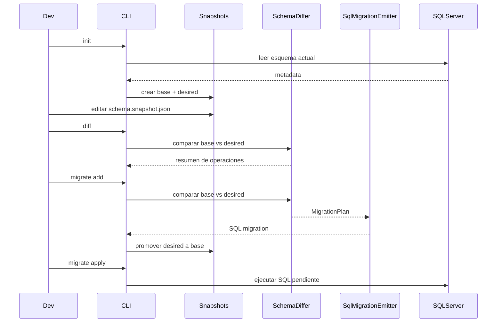
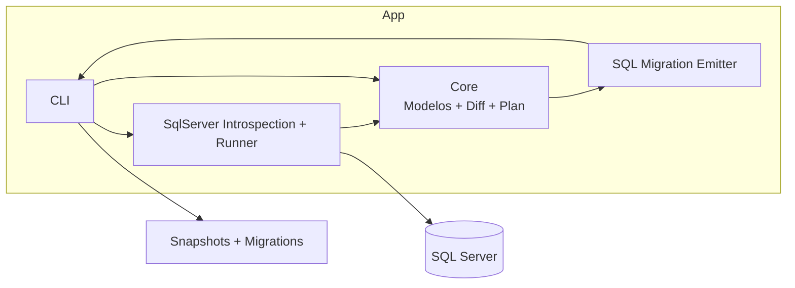
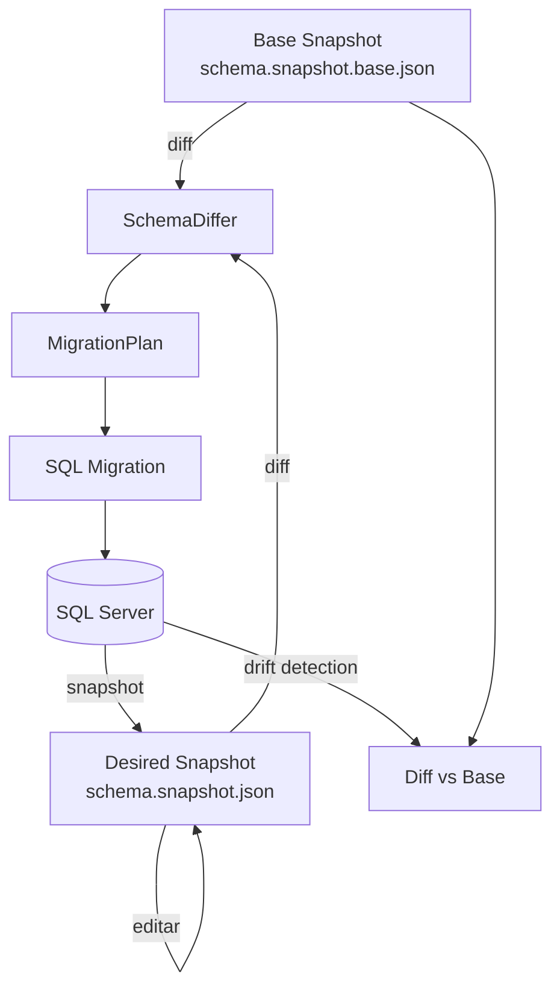
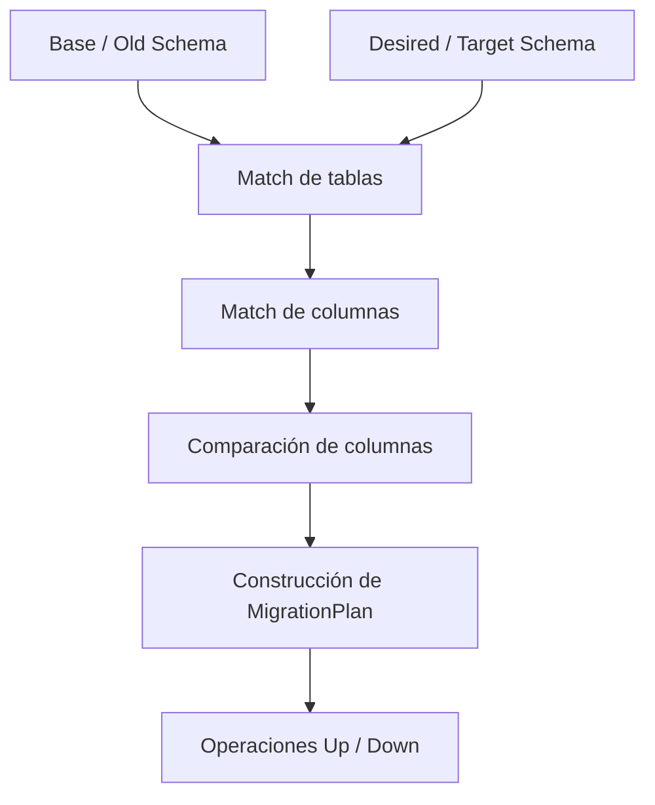

# Frapper


Un conjunto de utilidades para inspeccionar esquemas de bases de datos SQL Server, generar snapshots de esquema y emitir artefactos de migración para arquitecturas .NET que trabajan con **Dapper** y **SQL explícito**.  
Proyecto modular compuesto por librerías y una herramienta de línea de comandos.

---

## ¿Qué es Frapper?

**Migraciones de base de datos para arquitecturas .NET que utilizan Dapper.**

Frapper es una herramienta diseñada para equipos que utilizan **Dapper como ORM principal** y necesitan un mecanismo confiable para **versionar y evolucionar el esquema de la base de datos**, similar a lo que ofrecen las migraciones de Entity Framework, pero sin obligar al equipo a adoptar un ORM full-featured ni a tratar las clases C# como fuente de verdad del esquema.

La idea central es simple: permitir que los equipos mantengan **control total sobre el SQL que ejecutan**, sin renunciar a las ventajas de un sistema de migraciones estructurado.

Hoy Frapper combina dos ideas:

- un enfoque **database-first**, porque puede introspectar el estado real de SQL Server;
- un enfoque **snapshot-driven**, porque el flujo principal de trabajo gira en torno a snapshots versionables que describen el estado aprobado y el estado deseado del esquema.

En otras palabras: Frapper no obliga a modelar el esquema con clases C#, ni a delegar el SQL a un ORM.  
La evolución del esquema ocurre a partir de **snapshots determinísticos + diff estructural + SQL explícito**.

---

## El Problema

En muchos sistemas .NET de alto rendimiento, los equipos prefieren **Dapper** en lugar de Entity Framework debido a varias razones:

- Permite **control total sobre el SQL** ejecutado.
- Evita el SQL complejo o subóptimo que a veces generan los ORMs.
- Facilita la optimización manual de consultas críticas.
- Reduce la complejidad de la capa de acceso a datos.
- Es más predecible en entornos de producción con cargas elevadas.

Sin embargo, esta decisión introduce una desventaja clara:

**Dapper no provee un sistema de migraciones para versionar el esquema de la base de datos.**

Esto suele llevar a soluciones menos ideales como:

- Scripts SQL manuales
- Procesos de despliegue frágiles
- Herramientas externas desconectadas del flujo de desarrollo
- Inconsistencias entre entornos
- Riesgo de drift entre ambientes
- Falta de trazabilidad clara sobre cómo evolucionó el esquema

---

## La Solución

Frapper resuelve este problema introduciendo **migraciones basadas en snapshots de esquema**, sin depender de modelos ORM.

A diferencia de Entity Framework, donde las migraciones se generan a partir de clases C#, Frapper puede trabajar con:

- el **estado actual del esquema en SQL Server**
- un **snapshot base aprobado**
- un **snapshot deseado editable**

El flujo general es el siguiente:

1. Frapper lee el esquema actual de la base de datos.
2. Genera uno o más **snapshots determinísticos** del esquema.
3. Cuando el esquema deseado cambia, Frapper calcula un **diff estructural** entre snapshots.
4. El diff se convierte en una **migración SQL revisable**.
5. El equipo conserva control total sobre el SQL emitido y puede inspeccionarlo antes de ejecutarlo.
6. Las migraciones pueden aplicarse posteriormente sobre la base de datos real, con historial de ejecución.

De esta manera, el esquema de la base de datos deja de depender de scripts ad hoc y pasa a tener un flujo trazable, versionable y automatizable.

---

## EF Core vs Frapper

| Aspecto | EF Core Migrations | Frapper |
|---|---|---|
| Fuente de verdad | Modelos C# | Snapshots de esquema / SQL Server |
| Filosofía | ORM-first | Database-first / Dapper-friendly |
| Generación de cambios | Desde clases y metadatos EF | Desde diff de snapshots de esquema |
| Control del SQL | Parcial / mediado por EF | Alto, explícito y revisable |
| Ajuste para equipos Dapper | Bajo | Alto |

---

## Filosofía del Proyecto

Frapper está diseñado para complementar arquitecturas **Dapper-first**.

La responsabilidad de cada componente queda clara:

| Componente | Responsabilidad |
|------------|----------------|
| Dapper | Acceso a datos en tiempo de ejecución |
| SQL Server | Fuente de estado real del esquema |
| Frapper | Versionado del esquema, snapshots, diff y generación/aplicación de migraciones |

Esto permite que cada herramienta haga exactamente lo que mejor sabe hacer.

---

## Conceptos clave

Para entender el flujo actual de Frapper, conviene distinguir tres conceptos:

### 1. Base snapshot

`schema.snapshot.base.json`

Representa el **estado aprobado** del esquema.

Es el punto de comparación para saber qué cambió.

---

### 2. Desired snapshot

`schema.snapshot.json`

Representa el **estado deseado** del esquema.

Este archivo puede editarse y describe cómo debería quedar la base de datos.

---

### 3. Base de datos real

SQL Server representa el estado físico real de la base.  
Frapper puede leerlo para:

- inicializar un proyecto
- refrescar snapshots
- detectar drift
- validar si las migraciones ya alinearon correctamente la base con el estado aprobado

---

## Flujo de Trabajo

Un flujo típico utilizando Frapper, en su estado actual, se ve así:

### 1. Inicializar un proyecto Frapper

```bash
frapper init --connection Default
```

Esto crea:

```text
frapper.config.json
schema.snapshot.base.json
schema.snapshot.json
migrations/
```

Al inicio, ambos snapshots quedan iguales porque representan el esquema actual de la base.

---

### 2. Cambiar el esquema deseado

En el flujo principal actual, no es necesario alterar la base manualmente con SQL para diseñar una migración.

En cambio, se modifica el snapshot deseado:

`schema.snapshot.json`

Por ejemplo, agregando una nueva columna dentro de una tabla ya existente.

Ejemplo conceptual:

```json
{
  "columnId": 3,
  "name": "CreatedAt",
  "storeType": "datetime2",
  "isNullable": false,
  "isIdentity": false,
  "length": null,
  "precision": null,
  "scale": null,
  "defaultSql": "GETUTCDATE()"
}
```

---

### 3. Verificar las diferencias

```bash
frapper diff
```

Esto compara:

```text
schema.snapshot.base.json
vs
schema.snapshot.json
```

Y muestra un resumen de operaciones detectadas.

Ejemplo de salida:

```text
Diff completed successfully.
Created tables: 0
Dropped tables: 0
Added columns: 1
Dropped columns: 0
Altered columns: 0
Total operations: 1
```

---

### 4. Generar una migración

```bash
frapper migrate add AddCreatedAtToOrders
```

Frapper:

- lee el snapshot base
- lee el snapshot deseado
- calcula el diff
- genera un archivo `.sql` en `migrations/`
- actualiza `schema.snapshot.base.json` para igualarlo con `schema.snapshot.json`

Ejemplo conceptual de SQL emitido:

```sql
ALTER TABLE [dbo].[Orders]
ADD [CreatedAt] DATETIME2 NOT NULL DEFAULT GETUTCDATE();
```

> Nota: hoy `migrate add` no solo genera SQL. También **promueve el snapshot deseado a base** si la migración fue generada correctamente.

---

### 5. Aplicar las migraciones

```bash
frapper migrate apply
```

Frapper:

- revisa `migrations/`
- detecta qué scripts aún no se han aplicado
- ejecuta las migraciones pendientes sobre la base de datos real
- registra historial en `dbo.__FrapperMigrationsHistory`

---

### 6. Verificar alineación final

```bash
frapper diff --connection Default
```

Esto compara:

```text
schema.snapshot.base.json
vs
base de datos real
```

Si todo quedó correctamente alineado, el resultado esperado es:

```text
Total operations: 0
```

---

## Flujos posibles de Frapper

A nivel práctico, hoy Frapper soporta varios flujos distintos.

### Flujo A — Flujo principal snapshot-driven

1. `frapper init --connection Default`
2. editar `schema.snapshot.json`
3. `frapper diff`
4. `frapper migrate add NombreMigracion`
5. `frapper migrate apply`
6. `frapper diff --connection Default`

Este es el flujo principal del proyecto hoy.

---

### Flujo B — Refrescar snapshot desde la DB real

```bash
frapper snapshot
```

Sirve para traer el estado actual de la base de datos al snapshot deseado.

Conceptualmente:

```text
DB real → schema.snapshot.json
```

Es útil cuando:

- quieres re-sincronizar el snapshot con la DB real
- hubo cambios manuales en la base
- estás incorporando Frapper a una base existente

> Importante: en el flujo actual, `snapshot` no reemplaza a `migrate add` como mecanismo de promoción del base snapshot. El `base snapshot` representa el estado aprobado y debe protegerse de sobrescrituras accidentales.

---

### Flujo C — Drift detection

```bash
frapper diff --connection Default
```

Sirve para detectar si la base de datos real se desalineó del snapshot aprobado.

Es útil para:

- QA
- staging
- producción
- CI/CD
- auditoría de cambios manuales

---

### Flujo D — Comparación explícita snapshot vs snapshot

```bash
frapper diff --base schema.snapshot.base.json --target schema.snapshot.json
```

Útil cuando se quiere controlar explícitamente qué archivos comparar.

---

### Flujo E — Comparación explícita snapshot vs DB real

```bash
frapper diff --base schema.snapshot.base.json --connection Default
```

Útil cuando se quiere verificar explícitamente si el estado aprobado coincide con la base real.

---

## Qué hace hoy Frapper

Actualmente el proyecto ya cubre una base sólida para el problema principal:

- **Inspección del catálogo de SQL Server**
- **Modelado del esquema** en objetos del dominio
- **Normalización de tipos SQL**
- **Generación de snapshots determinísticos**
- **Comparación estructural entre snapshots**
- **Emisión de SQL de migración**
- **Aplicación de migraciones SQL con historial**
- **Diff contra base de datos real**
- **Detección de drift**
- **Suite de tests** para proteger comportamiento crítico

---

## Qué todavía le falta

Frapper todavía no pretende ser un reemplazo completo de todas las capacidades de un framework maduro de migraciones. Algunas áreas pendientes o parciales son:

- Soporte más completo para **foreign keys**
- Soporte para **índices**
- Soporte para **unique constraints**
- Detección semántica de **renames** (evitar drop + create cuando en realidad hubo rename)
- Soporte para **views**, **triggers** y **stored procedures**
- Estrategias robustas de **rollback / down migration**
- Más defaults automáticos y ergonomía en la CLI
- Validaciones adicionales para cambios destructivos en producción
- Más capacidad para sincronización bi-direccional controlada entre snapshots y DB real

---

## Fortalezas

Frapper tiene varias fortalezas importantes, especialmente para un enfoque Dapper-first:

- **Database-first real**: el esquema de la base es una referencia central.
- **Dapper-friendly**: no obliga al equipo a incorporar EF Core.
- **SQL explícito y auditable**: el resultado puede revisarse antes de ejecutarse.
- **Snapshots determinísticos**: ideal para Git, revisión de cambios y reproducibilidad.
- **Arquitectura modular**: separación clara entre lectura, modelo, diff, emisión y ejecución.
- **Tests útiles**: ayudan a mantener estabilidad mientras el proyecto crece.
- **Detección de drift**: permite comparar snapshots aprobados contra el estado real de la base.

---

## Deficiencias / limitaciones actuales

También es importante ser transparente respecto a sus limitaciones actuales:

- Aún está orientado principalmente a **SQL Server**.
- Algunos cambios complejos todavía pueden requerir revisión y ajuste manual.
- El motor aún no modela todas las estructuras del catálogo con el mismo nivel de profundidad.
- Algunos cambios pueden representarse de forma segura pero todavía no de forma “inteligente” (por ejemplo, renames).
- El flujo snapshot-driven todavía puede seguir mejorando en ergonomía y automatización.

---

## Estado

- Compilado actualmente contra `net8.0`.
- La CLI puede empaquetarse e instalarse como herramienta (`dotnet tool`).
- Los tests principales ya validan escenarios relevantes de snapshot, diff, emisión y aplicación.

---

## Estructura del proyecto

- `src/Frapper.Cli` – Interfaz de línea de comandos para usar las funcionalidades.
- `src/Frapper.Core` – Modelos del dominio (`DatabaseSchema`, `DbTable`, `DbColumn`, `DbPrimaryKey`, etc.), operaciones y lógica de comparación/diff.
- `src/Frapper.SqlServer` – Introspección del catálogo de SQL Server, lectura del esquema y ejecución de migraciones.
- `src/Frapper.EFMigrationEmitter` – Emisor de operaciones/migraciones SQL.
- `tests/Frapper.Core.Tests` – Tests del dominio y diff.
- `tests/Frapper.SqlServer.Tests` – Tests de lectura y normalización.
- `tests/Frapper.EFMigrationEmitter.Tests` – Tests del emisor y warnings.
- `tests/Frapper.Cli.Tests` – Tests de handlers y flujos de la CLI.

---

## Dependencias

- SDK: **.NET 8 SDK**
- Base de datos: **SQL Server**
- Cliente de conexión: **Microsoft.Data.SqlClient**

---

## Compilar y ejecutar

### Restaurar y compilar

```powershell
dotnet restore
dotnet build
```

### Ejecutar la CLI desde el proyecto

```powershell
dotnet run --project src\Frapper.Cli
```

### Ejecutar el binario compilado directamente

```powershell
& .\src\Frapper.Cliin\Debug
et8.0\Frapper.Cli.exe
```

### Empaquetar como herramienta

```powershell
dotnet pack .\src\Frapper.Cli\Frapper.Cli.csproj -c Release
```

### Instalar / actualizar como tool local o global

Ejemplo global:

```powershell
dotnet tool install --global frapper --add-source C:
utal\directorio\que\contiene\el
upkg
```

o actualización:

```powershell
dotnet tool update --global frapper --add-source C:
utal\directorio\que\contiene\el
upkg
```

> Nota: `--add-source` debe apuntar a la **carpeta** que contiene el `.nupkg`, no al archivo `.nupkg` directamente.

---

## Comandos disponibles

### Ver ayuda general

```bash
frapper --help
```

### Inicializar proyecto

```bash
frapper init --connection Default
```

### Generar / refrescar snapshot deseado

```bash
frapper snapshot
```

Opcionalmente:

```bash
frapper snapshot --connection Default
```

### Comparar snapshots

```bash
frapper diff
```

o de forma explícita:

```bash
frapper diff --base schema.snapshot.base.json --target schema.snapshot.json
```

### Comparar snapshot aprobado vs DB real

```bash
frapper diff --connection Default
```

o explícitamente:

```bash
frapper diff --base schema.snapshot.base.json --connection Default
```

### Generar migración

```bash
frapper migrate add AddCreatedAtToOrders
```

o con opciones explícitas:

```bash
frapper migrate add AddCreatedAtToOrders --snapshot schema.snapshot.json --base-snapshot schema.snapshot.base.json --out-dir migrations
```

### Aplicar migraciones

```bash
frapper migrate apply
```

o explícitamente:

```bash
frapper migrate apply --connection Default --dir migrations
```

---

## Uso interno (flujo resumido)

1. La CLI solicita lectura de snapshots o de la base de datos real.
2. `SqlServerSchemaReader` se conecta a SQL Server y lee metadata relevante del catálogo.
3. Los tipos se normalizan con `SqlServerTypeNormalizer`.
4. Se construyen objetos del dominio como `DatabaseSchema`, `DbTable`, `DbColumn` y `DbPrimaryKey`.
5. El snapshot puede serializarse o deserializarse con `SchemaSnapshotSerializer`.
6. `SchemaDiffer` compara esquemas y genera un `MigrationPlan`.
7. `SqlMigrationEmitter` convierte el plan en SQL.
8. `SqlServerMigrationRunner` ejecuta migraciones pendientes y registra historial.

---

## Ejemplo conceptual de SQL generado

Agregar columna:

```sql
ALTER TABLE [dbo].[Users]
ADD [CreatedAt] DATETIME2 NOT NULL DEFAULT GETUTCDATE();
```

Alterar columna:

```sql
ALTER TABLE [dbo].[Orders]
ALTER COLUMN [Status] NVARCHAR(30) NOT NULL;
```

Warning por cambio sensible:

```sql
-- WARNING: DEFAULT constraint change detected
```

---

## Diagrama de secuencia



---

## Diagrama de arquitectura



---

## Diagrama del modelo de snapshots



---

## Diagrama interno del Diff Engine



---

## Benchmark conceptual

No es un benchmark de performance ejecutado todavía, sino una comparación de posicionamiento técnico:

| Aspecto | EF Core Migrations | Frapper |
|---|---|---|
| Control del SQL | Medio | Alto |
| Dependencia del ORM | Alta | Baja |
| Alineación con Dapper | Baja | Alta |
| Determinismo del snapshot | N/A en este modelo | Alto |
| Facilidad para auditar cambios | Media | Alta |
| Portabilidad actual | Alta dentro del ecosistema EF | Hoy centrado en SQL Server |

---

## Estado de madurez

Frapper ya es útil como **prototipo funcional serio** y como base técnica real para evolucionar hacia una herramienta más completa.

Hoy ya ofrece:

- introspección de esquema
- snapshots determinísticos
- diff estructural
- generación de migraciones SQL
- aplicación de migraciones con historial
- detección de drift
- flujo usable para equipos Dapper-first

---

## Contribuir

- Abrir un issue describiendo la mejora o bug.
- Hacer fork + PR con una descripción clara del cambio.
- Agregar o actualizar tests cuando se modifique comportamiento del diff, del emisor o de la CLI.
- Priorizar cambios determinísticos y explícitos antes que heurísticas “mágicas”.

---

## Roadmap

Existe un roadmap natural para llevar Frapper a un nivel más alto:

- Más cobertura de objetos de base de datos
- Detección de renames
- Emisión más rica y segura
- Mejor soporte de sincronización entre snapshots y DB real
- Posible soporte futuro para otros motores distintos de SQL Server

Para más detalle, ver `ROADMAP.md`.

---

## Licencia

MIT License.
