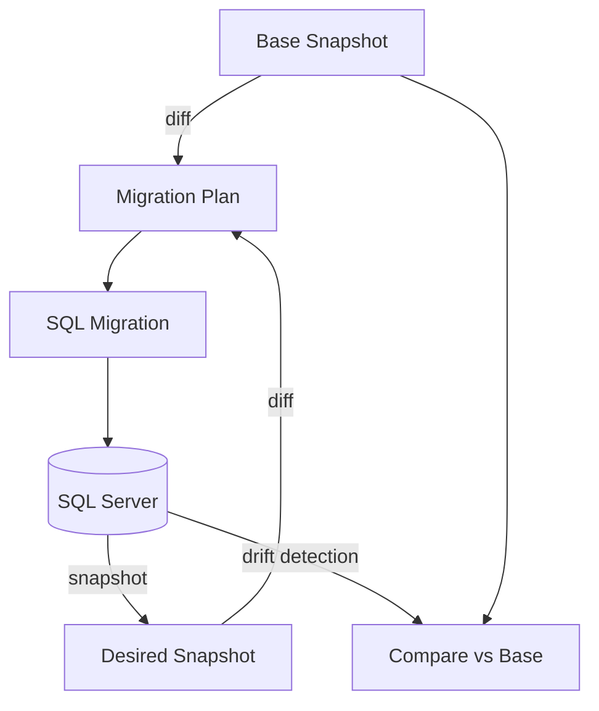

# Snapshots Model

Este documento describe el modelo de snapshots usado por Frapper.

---

## Idea central

Frapper trabaja con dos snapshots principales:

- `schema.snapshot.base.json`
- `schema.snapshot.json`

Y además puede comparar contra:

- la base de datos real

---

## Base snapshot

Archivo:

```text
schema.snapshot.base.json
```

Representa el **estado aprobado** del esquema.

Es la referencia oficial para calcular diferencias y generar migraciones.

---

## Desired snapshot

Archivo:

```text
schema.snapshot.json
```

Representa el **estado deseado** del esquema.

Es editable y expresa cómo debería quedar la base de datos.

---

## Base de datos real

SQL Server representa el estado físico actual.

Frapper puede leerlo para:

- inicializar un proyecto
- refrescar snapshots
- detectar drift
- verificar alineación final

---

## Relación entre los tres estados



---

## Flujo principal

### 1. Init

`frapper init` crea ambos snapshots inicialmente iguales.

### 2. Edición

El usuario modifica `schema.snapshot.json`.

### 3. Diff

`frapper diff` compara base vs desired.

### 4. Migrate add

`frapper migrate add` genera SQL y promueve desired a base.

### 5. Migrate apply

`frapper migrate apply` aplica las migraciones pendientes a la DB.

---

## Por qué dos snapshots

Separar base y desired permite:

- revisar cambios antes de aprobarlos
- versionar el estado aprobado
- usar Git de forma limpia
- detectar drift respecto a la DB real

---

## Snapshot generation

La clase responsable es:

```text
SchemaSnapshotSerializer
```

Los snapshots son JSON determinístico para facilitar:

- diff limpio en Git
- reproducibilidad
- inspección manual

---

## Uso recomendado

### Snapshot deseado

Usar `schema.snapshot.json` para diseñar cambios.

### Snapshot base

No editarlo manualmente. Debe ser promovido por el flujo de migración.

---

## Casos de uso de snapshot

### `frapper init`

Genera base y desired iniciales.

### `frapper snapshot`

Refresca el snapshot deseado desde la DB real.

### `frapper diff --connection`

Compara base snapshot contra DB real para detectar drift.
